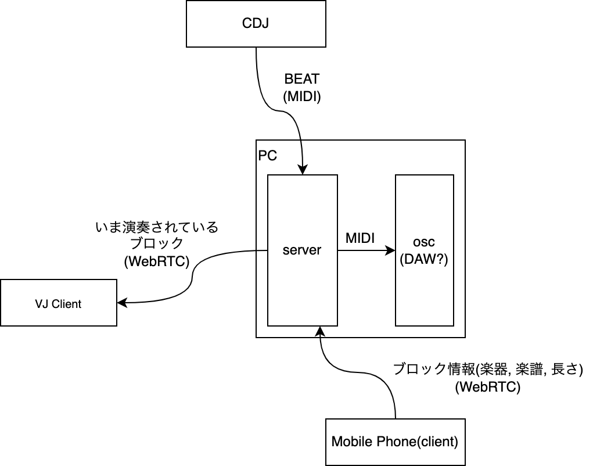
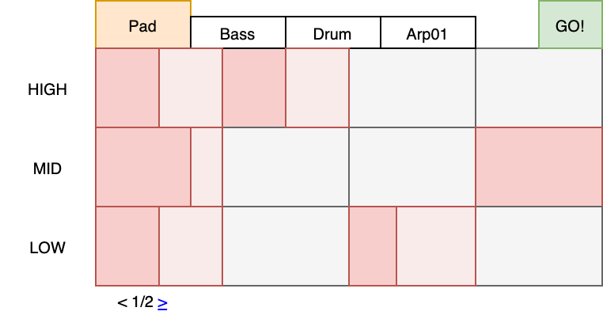
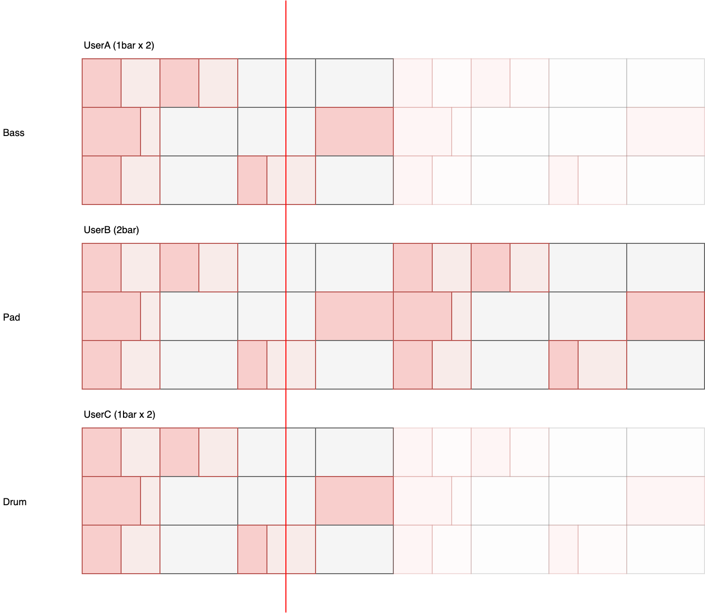

# jamming

This project is a web application for interweaving live interaction by multiple users to on-going musical performance. The objective here is to integrate several musical instants in a musical performance (e.g. DJ performance and laptop musical performance). In addition, this is a musical interface that seeks inclusion of the audience as performers.

## Configuration / Context

## Wireframe

### Mobile

The audience creates a graphic score using their mobile devices and sends it to the server.
Here, the music is divided into blocks of one or two bars in length, which are referred to as "block".
The block interface was inspired by Morton Feldman's "Projection 1 (1950)".\
\
After the block is sent to the server, each blocks will be evaluated by the server by a cycle of 4 bars. 

### VJ

Blocks sent by the audience are displayed in real time.
Visually indicate which notes are being played now in an easy-to-understand manner.
By using VJ to provide feedback, the audience interface can concentrate on creating the score.